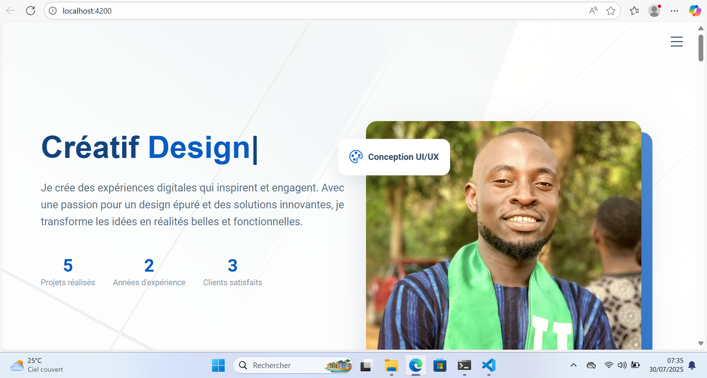
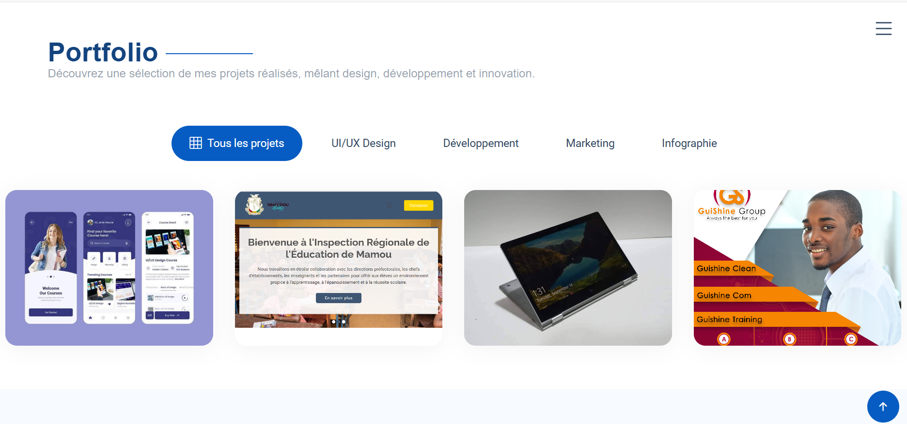
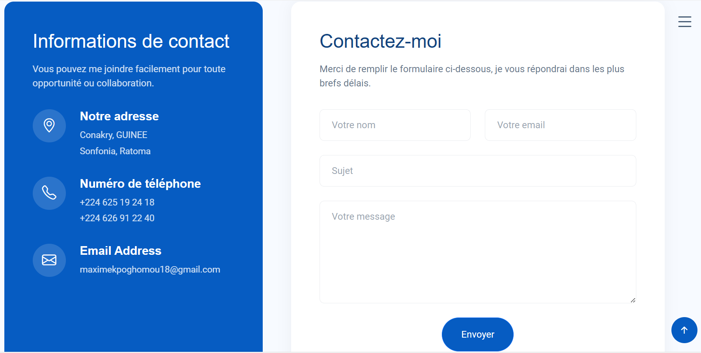

# 💼 Portfolio - Maxime Kpoghomou

Bienvenue sur mon portfolio en ligne, développé avec Angular.  
Il présente mes projets, mon parcours académique et mes expériences.

---

## 📸 Aperçu du portfolio

### 🏠 Page d'accueil

### 📂 Section Projets

### 📬 Page Contact

---

## ⚙️ Technologies utilisées

- Angular
- TypeScript
- Bootstrap
- Netlify (pour l'hébergement)

---

## 🚀 Démo en ligne

🔗 [Voir le portfolio en ligne](https://maximekpoghomou.netlify.app)

---

## 📫 Contact

Pour en savoir plus, contactez-moi :  
Email:maximekpoghomou18@example.com
Telephone: +224 625 19 24 18/ +224 626 91 22 40
